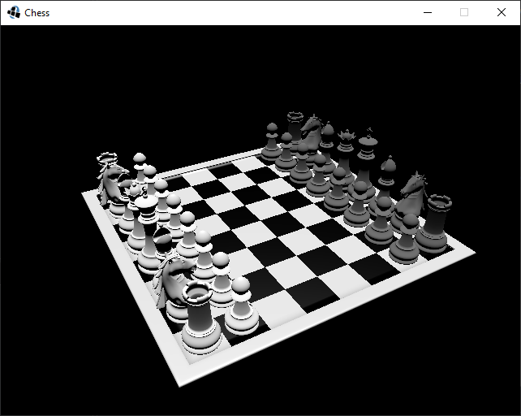
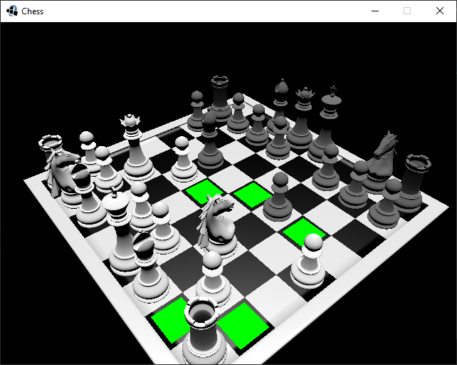
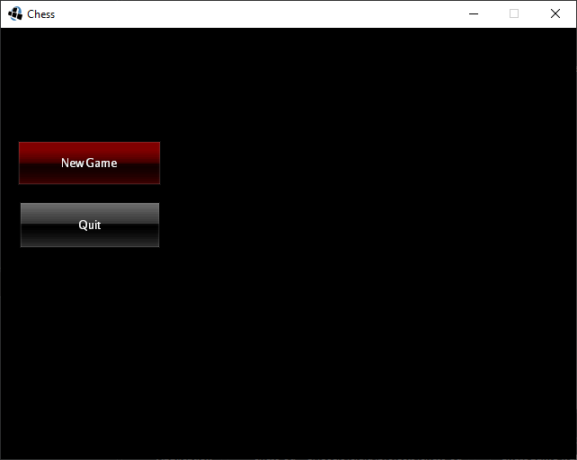

# Chess Game
A very basic 3D chess game written in Java using the jMonkeyEngine. The AI uses the [minimax](https://en.wikipedia.org/wiki/Minimax) algorithm with an evaluation function that gives the board a rating for each side based on the position of the chess pieces on the board and the possible moves they can make.

## Build instructions
 - Install the [jMonkeyEngine SDK](https://jmonkeyengine.org/)
 - Open the project in the SDK
 - Build & run
